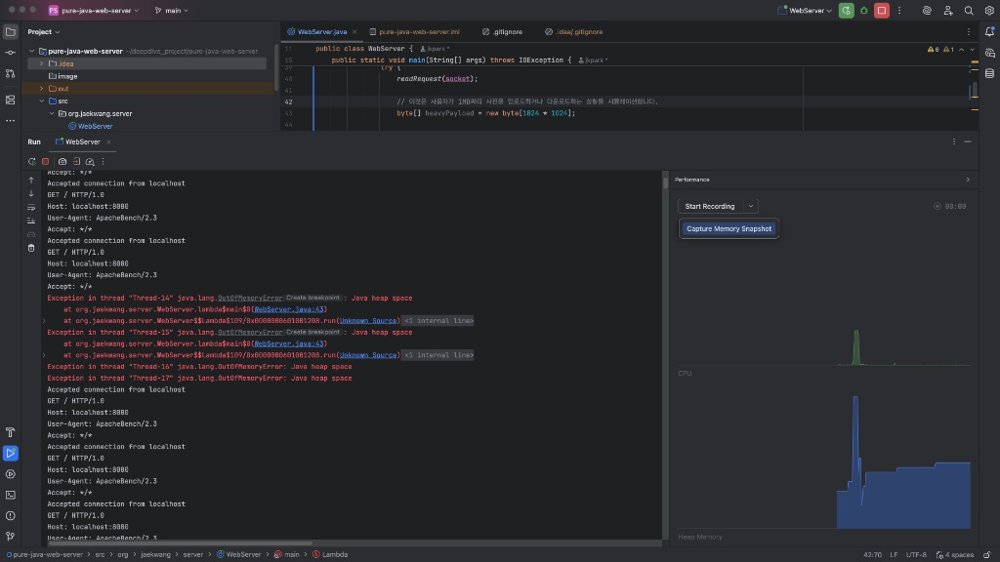
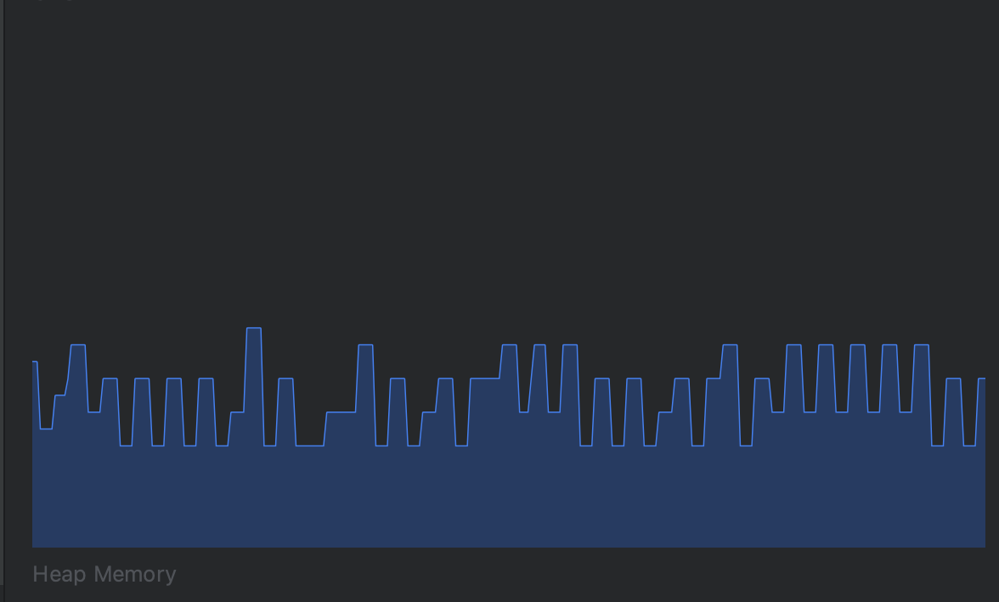
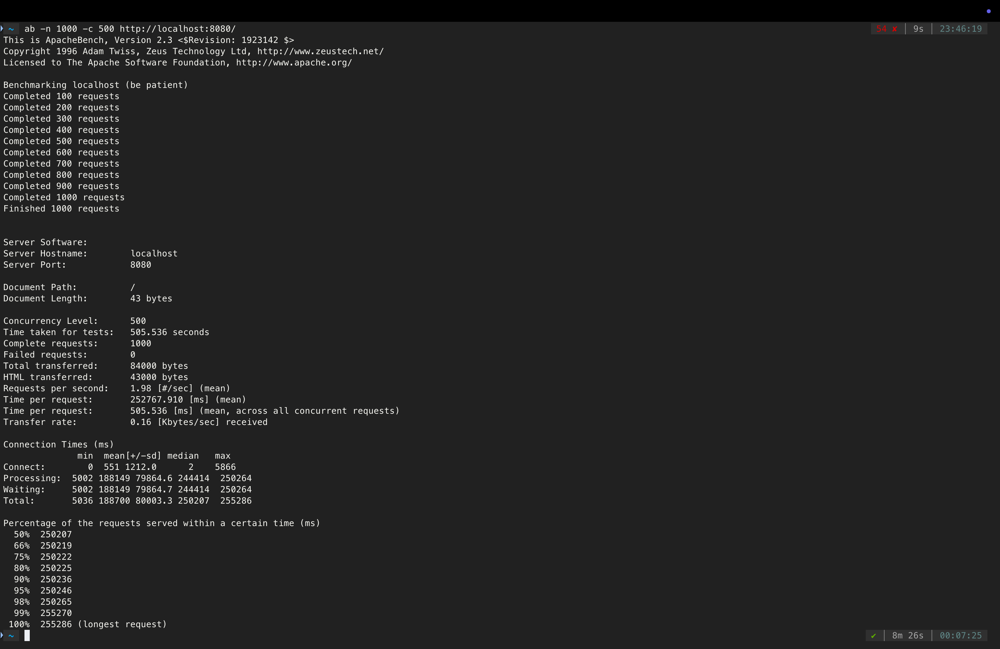
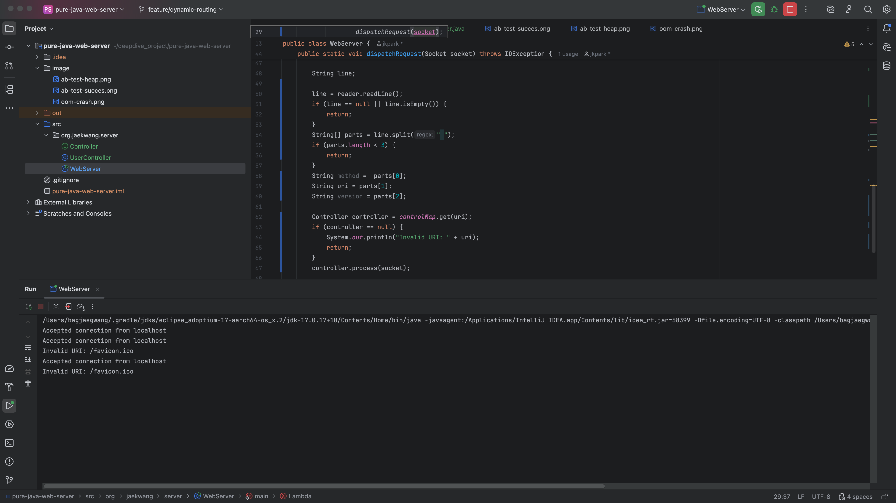

# Pure Java Web Server Deep Dive

Spring Boot 같은 웹 프레임워크의 내부 동작 원리를 깊이 있게 이해하기 위해, 순수 Java Socket만을 이용하여 밑바닥부터 구현한 다중 접속 웹 서버입니다.

## 아키텍처 변경 및 성능 튜닝 (Phase 1~3)

### Problem: 무한 스레드 생성 아키텍처의 한계 (v1.0)
초기 구현 시, 클라이언트 요청마다 새로운 스레드를 무한정 생성(`new Thread()`)하도록 설계했습니다.
* **부하 테스트:** Apache Bench(ab)를 이용해 500개의 동시 접속 트래픽 발생(장애 상황을 통제된 환경에서 재현하기 위해 JVM 힙 메모리 최대치를 제한)
* **장애 결과:** 스레드 생성 오버헤드 및 컨텍스트 스위칭 비용 급증. 결국 JVM 힙 메모리 고갈로 인한 `java.lang.OutOfMemoryError`가 발생하며 서버가 완전히 다운되었습니다.

---

### Solution & Insight: 고정 크기 스레드 풀(Fixed Thread Pool) 도입 (v2.0)
시스템 자원의 한계를 확인하고, 감당할 수 있는 트래픽만 처리하기 위해 `ExecutorService`를 활용한 고정 크기 스레드 풀 아키텍처로 개편했습니다.

**1. 메모리 방어와 GC(Garbage Collector) 정상화**
스레드 풀 도입 후 가장 큰 변화는 메모리의 안정성입니다. 아래 프로파일러 그래프에서 보이듯, 무한정 치솟던 메모리가 규칙적인 톱니바퀴 형태를 띠게 되었습니다. 이를 통해 메모리가 차오르더라도 자바의 GC가 정상적으로 개입하여 시스템을 안정적으로 청소 및 유지하고 있다는 것을 확인했습니다.

**2. 가용성과 지연 시간의 Trade-off 증명**
동일하게 500개의 동시 접속 트래픽(총 1000개 요청)을 발생시킨 결과입니다. 
초과된 요청들이 내부 큐(Queue)에서 스레드를 할당 받기 전까지 대기하면서 가장 오래 걸린 요청의 응답 시간이 4분(255,286ms) 이상으로 크게 지연되었습니다. 그러나 단 한 건의 실패도 없이 1000개의 요청을 정상적으로 모두 처리했습니다.

이를 통해 무한 스레드를 통한 '서버 다운(가용성 상실)'이라는 최악의 결과를 피하는 대신, '클라이언트 대기 시간 증가'라는 트레이드오프를 선택한 올바른 결정임을 확인했습니다. 또한, 서버를 다운시키지 않으면서 응답시간을 최소화 할 수 있는 최적의 스레드 풀 사이즈 설정이 중요한 과제임을 인지할 수 있었습니다.

---

## 아키텍처 변경 및 라우팅 최적화 (Phase 4)
### DispatcherServlet 로직의 순수 자바 구현 (v3.0)

### Problem: 정적이고 하드코딩된 라우팅 구조의 한계
초기 모델은 클라이언트의 요청 경로(URI)를 식별하지 못하고, 단일 경로의 하드코딩된 로직만 수행하는 정적 파일 서버 수준에 머물러 있었습니다.
독립적이고 다양한 API 요청을 각 스레드에 동적으로 할당하여 웹 서버의 역할을 수행하기 위해서는, HTTP 요청 라인을 파싱해 URI를 식별하는 라우터가 필수적이었습니다. 또한, 컨트롤러 매핑 과정에서 경로 탐색 비용이 시스템의 병목이 되지 않도록 최적화된 자료구조의 도입이 필요함을 인지했습니다.

---

### Solution & Insight: HashMap 라우터와 다형성(Polymorphism) 도입
스프링 프레임워크의 `HandlerMapping` 동작 원리에 착안하여, 동적 라우팅 아키텍처로 전면 개편했습니다.

1. **다형성 기반의 Controller 인터페이스 설계**
    - 모든 요청 핸들러가 지켜야 할 `process(Socket socket)` 인터페이스를 도입하여, 메인 서버가 개별 컨트롤러의 구체적인 구현을 몰라도 되도록 관심사를 분리했습니다.

2. **HashMap 기반의 O(1) 라우터 구축**
    - 서버 부팅 시점에 `static` 블록을 활용하여 `Map<String, Controller>`에 라우팅 정보를 미리 적재했습니다.
    - 결과적으로 클라이언트 요청 시 O(1)의 시간 복잡도로 즉각적인 컨트롤러 매핑이 가능해졌으며, 새로운 API가 추가되어도 메인 서버 코드는 수정할 필요 없는 유연한 구조를 달성했습니다.

 

*Insight: 엣지 케이스 방어*
- 브라우저가 백그라운드에서 자동으로 요청하는 `/favicon.ico` 등의 비정상 URI 요청을 HashMap 조회 시 `null` 체크를 통해 안전하게 걸러내어, 스레드 종료 및 서버 다운을 방어하는 로직을 추가했습니다.

---
