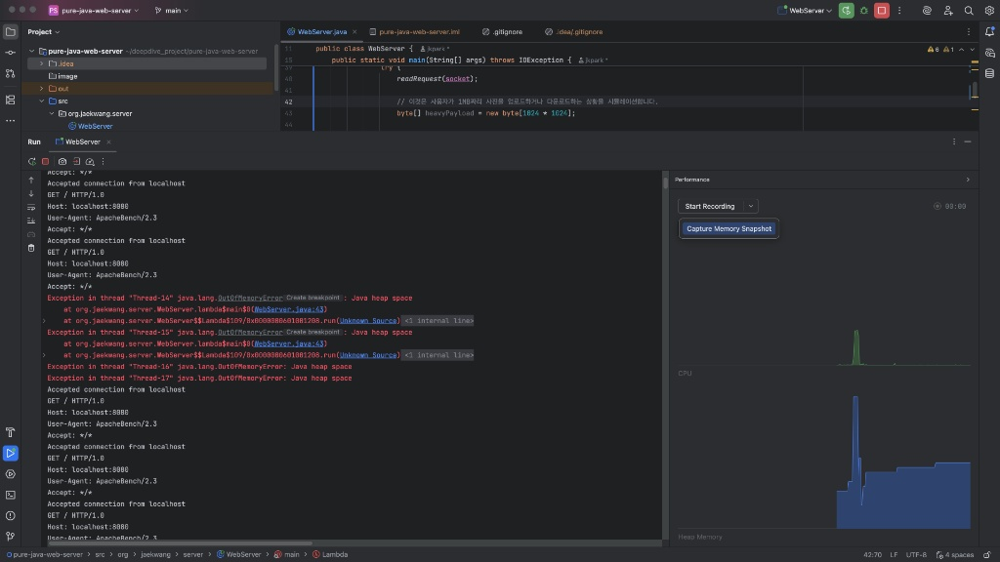
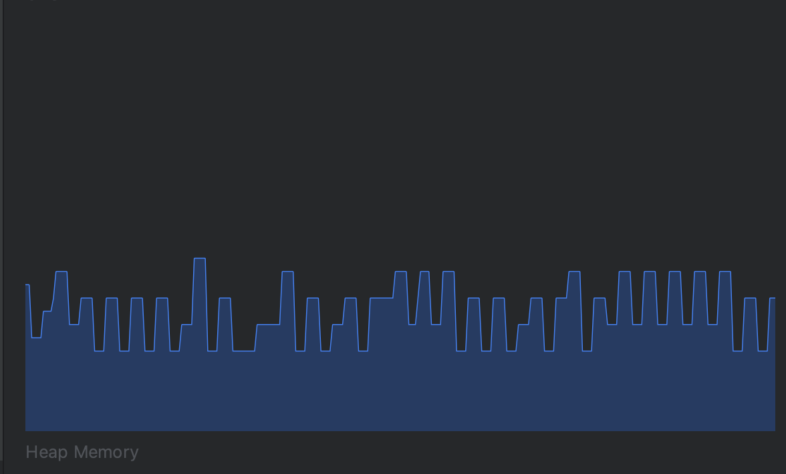
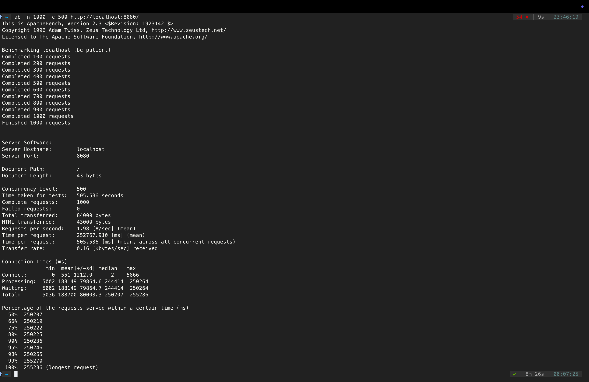
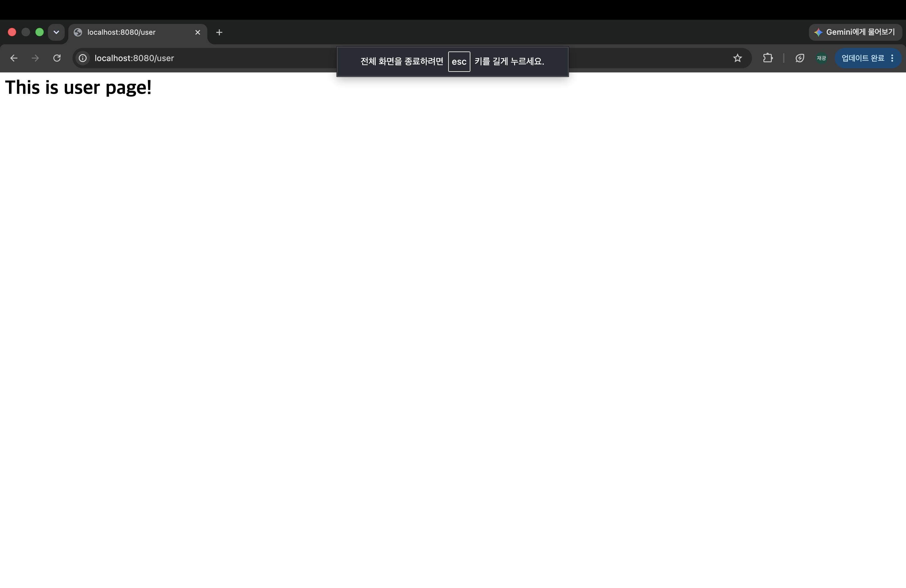
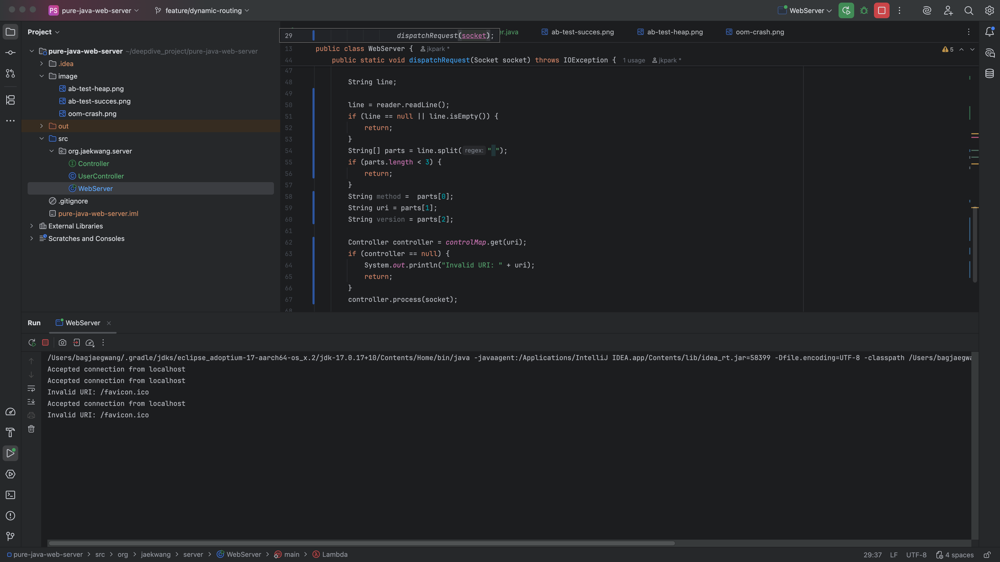
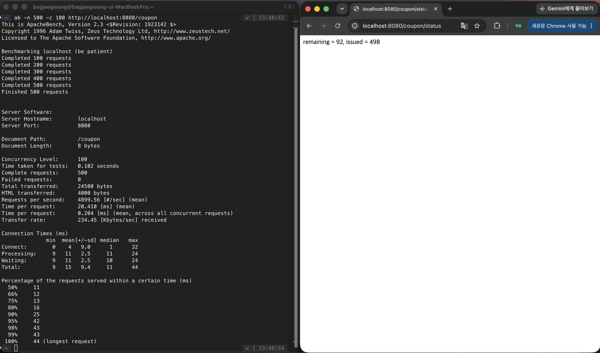
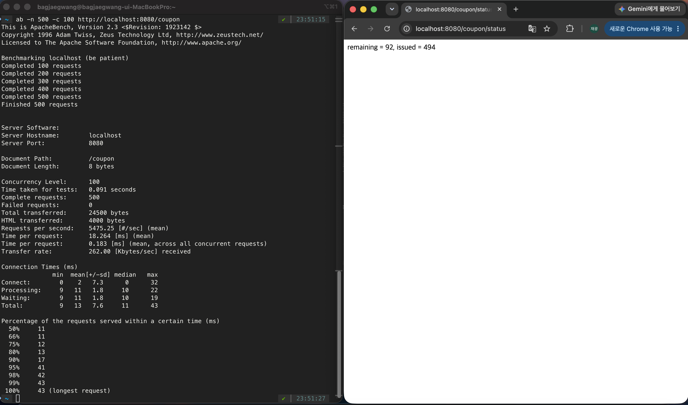

# Pure Java Web Server Deep Dive

Spring Boot 같은 웹 프레임워크의 내부 동작 원리를 깊이 있게 이해하기 위해, 순수 Java Socket만을 이용하여 밑바닥부터 구현한 다중 접속 웹 서버입니다.

## 아키텍처 변경 및 성능 튜닝 (Phase 1~3)

### Problem: 무한 스레드 생성 아키텍처의 한계 (v1.0)
초기 구현 시, 클라이언트 요청마다 새로운 스레드를 무한정 생성(`new Thread()`)하도록 설계했습니다.
* **부하 테스트:** Apache Bench(ab)를 이용해 500개의 동시 접속 트래픽 발생(장애 상황을 통제된 환경에서 재현하기 위해 JVM 힙 메모리 최대치를 제한)
* **장애 결과:** 스레드 생성 오버헤드 및 컨텍스트 스위칭 비용 급증. 결국 JVM 힙 메모리 고갈로 인한 `java.lang.OutOfMemoryError`가 발생하며 서버가 완전히 다운되었습니다.

---

### Solution & Insight: 고정 크기 스레드 풀(Fixed Thread Pool) 도입 (v2.0)
시스템 자원의 한계를 확인하고, 감당할 수 있는 트래픽만 처리하기 위해 `ExecutorService`를 활용한 고정 크기 스레드 풀 아키텍처로 개편했습니다.

**1. 메모리 방어와 GC(Garbage Collector) 정상화**
스레드 풀 도입 후 가장 큰 변화는 메모리의 안정성입니다. 아래 프로파일러 그래프에서 보이듯, 무한정 치솟던 메모리가 규칙적인 톱니바퀴 형태를 띠게 되었습니다. 이를 통해 메모리가 차오르더라도 자바의 GC가 정상적으로 개입하여 시스템을 안정적으로 청소 및 유지하고 있다는 것을 확인했습니다.

**2. 가용성과 지연 시간의 Trade-off 증명**
동일하게 500개의 동시 접속 트래픽(총 1000개 요청)을 발생시킨 결과입니다. 
초과된 요청들이 내부 큐(Queue)에서 스레드를 할당 받기 전까지 대기하면서 가장 오래 걸린 요청의 응답 시간이 4분(255,286ms) 이상으로 크게 지연되었습니다. 그러나 단 한 건의 실패도 없이 1000개의 요청을 정상적으로 모두 처리했습니다.

이를 통해 무한 스레드를 통한 '서버 다운(가용성 상실)'이라는 최악의 결과를 피하는 대신, '클라이언트 대기 시간 증가'라는 트레이드오프를 선택한 올바른 결정임을 확인했습니다. 또한, 서버를 다운시키지 않으면서 응답시간을 최소화 할 수 있는 최적의 스레드 풀 사이즈 설정이 중요한 과제임을 인지할 수 있었습니다.

---

## 아키텍처 변경 및 라우팅 최적화 (Phase 4)
### DispatcherServlet 로직의 순수 자바 구현 (v3.0)

### Problem: 정적이고 하드코딩된 라우팅 구조의 한계
초기 모델은 클라이언트의 요청 경로(URI)를 식별하지 못하고, 단일 경로의 하드코딩된 로직만 수행하는 정적 파일 서버 수준이었습니다.
독립적이고 다양한 API 요청을 각 스레드에 동적으로 할당하여 웹 서버의 역할을 수행하기 위해서는, HTTP 요청 라인을 파싱해 URI를 식별하는 라우터가 필수적이었습니다. 또한, 컨트롤러 매핑 과정에서 경로 탐색 비용이 시스템의 병목이 되지 않도록 최적화된 자료구조의 도입이 필요함을 인지했습니다.

---

### Solution & Insight: HashMap 라우터와 다형성(Polymorphism) 도입
스프링 프레임워크의 `HandlerMapping` 동작 원리에 착안하여, 동적 라우팅 아키텍처로 전면 개편했습니다.

1. **다형성 기반의 Controller 인터페이스 설계**
    - 모든 요청 핸들러가 지켜야 할 `process(Socket socket)` 인터페이스를 도입하여, 메인 서버가 개별 컨트롤러의 구체적인 구현을 몰라도 되도록 관심사를 분리했습니다.

2. **HashMap 기반의 O(1) 라우터 구축**
    - 서버 부팅 시점에 `static` 블록을 활용하여 `Map<String, Controller>`에 라우팅 정보를 미리 적재했습니다.
    - 결과적으로 클라이언트 요청 시 O(1)의 시간 복잡도로 즉각적인 컨트롤러 매핑이 가능해졌으며, 새로운 API가 추가되어도 메인 서버 코드는 수정할 필요 없는 유연한 구조를 설계했습니다.

 

*Insight: 엣지 케이스 방어*
- 브라우저가 백그라운드에서 자동으로 요청하는 `/favicon.ico` 등의 비정상 URI 요청을 HashMap 조회 시 `null` 체크를 통해 안전하게 걸러내어, 스레드 종료 및 서버 다운을 방어하는 로직을 추가했습니다.

---

## 객체 지향적 HTTP Request/Response 처리와 관심사 분리 (Phase 5)

### Problem: 네트워크 I/O와 비즈니스 로직의 강한 결합 및 단일 책임 원칙 위배
기존 구조에서는 Controller가 직접 Socket 객체를 전달받아 처리하므로, 순수 비즈니스 로직이 네트워크 계층의 세부 구현에 강하게 종속되는 문제가 있었습니다. 또한, WebServer 클래스 내부의 DispatchRequest 라는 거대한 
메서드에서 스트림 개방, 문자열 파싱, 라우팅을 모두 수행하여 단일 책임 원칙을 크게 위배하고 있었습니다.

---

### Solution & Insight : Servlet 패턴 적용을 통한 책임 분리와 캡슐화 (v4.0)
Java Servlet의 동작 방식을 모티브로 삼아, 비즈니스 로직과 HTTP 프로토콜 파싱/응답 책임을 완벽히 분리하기 위해 HttpRequest와 HttpResponse 객체를 도입했습니다.
1. **HttpRequest 클래스 도입**
    - Socket의 InputStream을 주입받아 HTTP Method, URI, 쿼리 파라미터, 헤더를 파싱하고 내부 Map 구조로 캡슐화하여 제공합니다.
2. **HttpResponse 클래스 도입**
    - Socket의 OutputStream을 감싸고, sendOk, sendNotFound 등 상태 코드에 맞는 표준 HTTP 응답 텍스트 생성 로직을 도입했습니다.

*Insight: 관심사 분리*
- Controller는 전달받은 요청 데이터의 처리와 응답에만 집중할 수 있게 되었습니다. WebServer도 라우팅 역할만 수행하는 프론트 컨트롤러로 역할이 변경되어 시스템의 응집도는 높아지고 결합도는 낮아졌습니다.

---

## 동시성 제어 및 동기화 기법 성능 비교 (Phase 6)

### Problem: 다중 스레드 환경에서의 갱신 소실 및 초과 발급 문제 (테스트용 선착순 쿠폰 발급 시스템 로직 구현)
스레드 풀 기반의 서버 아키텍처에서 여러 워커 스레드가 공유 자원에 동시에 접근할 때 발생하는 경쟁 상태(Race Condition)를 검증하기 위해 선착순 쿠폰 발급 로직을 구현했습니다.

* **테스트 환경:** `Apache Bench`를 활용하여 총 500개의 요청을 100개의 동시 접속(`-n 500 -c 100`)으로 발생시켰습니다.
* **장애 결과:** 쿠폰의 초기 재고는 100개였으나, 부하 테스트 결과 발급된 쿠폰(issued)은 490여개로 한도를 초과했고, 남은 재고(remaining)는 90여개로 정상적인 차감이 이루어지지 않았습니다.

* **원인 분석**
  동기화 처리가 되지 않은 상태에서 수백 개의 스레드가 동시에 메모리상의 `remainingCoupons = X`(예: 100) 값을 읽어갔습니다. 이후 각 스레드가 연산을 마치고 `Y`(예 : 99)라는 결과를 덮어씌우는 과정이 중복해서 발생하면서, 실제로는 500번의 요청이 처리되었음에도 카운트 차감이 정상적으로 반영되지 않는 갱신 손실(Lost Update)이 발생했습니다.

  또한, 이 잘못된 갱신으로 인해 재고가 남아있는 것으로 판정되면서 쿠폰 발급 조건(if문)이 계속 통과되었고, 결과적으로 발급 수량(`issuedCoupons`)이 제한 개수를 한참 초과하여 비정상적으로 폭증하게 되었습니다.

---

